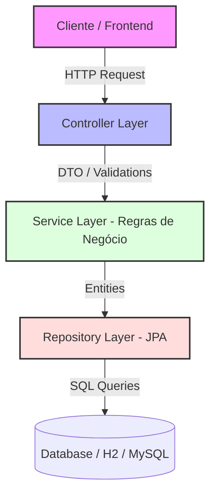

# 📝 Todo List REST API

[](https://openjdk.org/)
[](https://spring.io/projects/spring-boot)
[](https://www.mysql.com/)
[](https://maven.apache.org/)

Esta é uma API RESTful robusta e escalável desenvolvida em **Java** e **Spring Boot** para o gerenciamento eficiente de listas de tarefas (Todo List). O projeto foi concebido utilizando boas práticas de desenvolvimento de software, seguindo os princípios REST, arquitetura em camadas (Controller, Service, Repository) e tratamento global de exceções.

---

## 🎯 Principais Funcionalidades

*   **CRUD Completo:** Criação, leitura, atualização e exclusão de tarefas.
*   **Controle de Status:** Marcação e atualização de tarefas concluídas/pendentes.
*   **Tratamento de Exceções Global:** Retornos claros e formatados em JSON para recursos não encontrados ou erros de validação utilizando `@ControllerAdvice`.
*   **Validação de Dados:** Validações robustas dos dados de entrada utilizando Spring Validation (`@NotNull`, `@NotBlank`, `@Size`).
*   **Persistência de Dados:** Integração com bancos de dados relacionais com mapeamento objeto-relacional (ORM) dinâmico via Hibernate.

---

## 🛠️ Tecnologias Utilizadas

*   **Java 17** (Linguagem principal)
*   **Spring Boot 3.x**
    *   *Spring Web* (Criação de endpoints REST)
    *   *Spring Data JPA* (Abstração de persistência e consultas ao banco)
    *   *Spring Validation* (Validação de beans de dados)
*   **Hibernate** (Implementação JPA)
*   **H2 Database** (Banco de dados em memória para ambiente de desenvolvimento/testes)
*   **Maven** (Gerenciador de dependências e automação de builds)

---

## 📐 Arquitetura do Projeto

O projeto segue o padrão arquitetural clássico em camadas, garantindo baixo acoplamento e facilidade de manutenção:



---

## 📋 Documentação da API (Endpoints)

### **Rotas de Tarefas (`/api/todos`)**

| Método | Endpoint | Descrição | Status Esperado |
| :--- | :--- | :--- | :--- |
| **GET** | `/api/todos` | Lista todas as tarefas cadastradas | `200 OK` |
| **GET** | `/api/todos/{id}` | Busca uma tarefa específica pelo ID | `200 OK` / `404 Not Found` |
| **POST** | `/api/todos` | Cria uma nova tarefa | `201 Created` / `400 Bad Request` |
| **PUT** | `/api/todos/{id}` | Atualiza os dados de uma tarefa existente | `200 OK` / `404 Not Found` |
| **DELETE**| `/api/todos/{id}` | Remove uma tarefa do banco de dados | `204 No Content` / `404 Not Found` |

---

### **Exemplos de Payload (JSON)**

#### **Criar / Atualizar Tarefa (POST / PUT)**
**Request Body:**
```json
{
  "title": "Estudar Spring Boot",
  "description": "Praticar tratamento de exceções globais e mapeamento JPA",
  "completed": false
}
```

**Response Body (Exemplo 201 Created):**
```json
{
  "id": 1,
  "title": "Estudar Spring Boot",
  "description": "Praticar tratamento de exceções globais e mapeamento JPA",
  "completed": false,
  "createdAt": "2026-05-25T14:50:00Z"
}
```

---

## 🚀 Como Executar o Projeto Localmente

### **Pré-requisitos**
Para clonar, compilar e rodar a aplicação, você precisará de:
*   [Git](https://git-scm.com) instalado.
*   [Java JDK 17](https://www.oracle.com/java/technologies/downloads/) ou superior.
*   [Maven 3.x](https://maven.apache.org/) (opcional, o projeto inclui o Maven Wrapper `./mvnw`).

### **Passo a Passo**

1. **Clonar o repositório:**
   ```bash
   git clone https://github.com/lukxsz/TodoList.git
   cd TodoList
   ```

2. **Compilar o projeto:**
   ```bash
   ./mvnw clean install
   ```

3. **Executar a aplicação:**
   ```bash
   ./mvnw spring-boot:run
   ```

A API estará disponível localmente em: `http://localhost:8080`

---

## 👤 Autor

Desenvolvido por **Lukas Grava da Silva**  
*   **LinkedIn:** [linkedin.com/in/lukasgravadasilva](https://www.linkedin.com/in/lukasgravadasilva)
*   **GitHub:** [@lukxsz](https://github.com/lukxsz)

